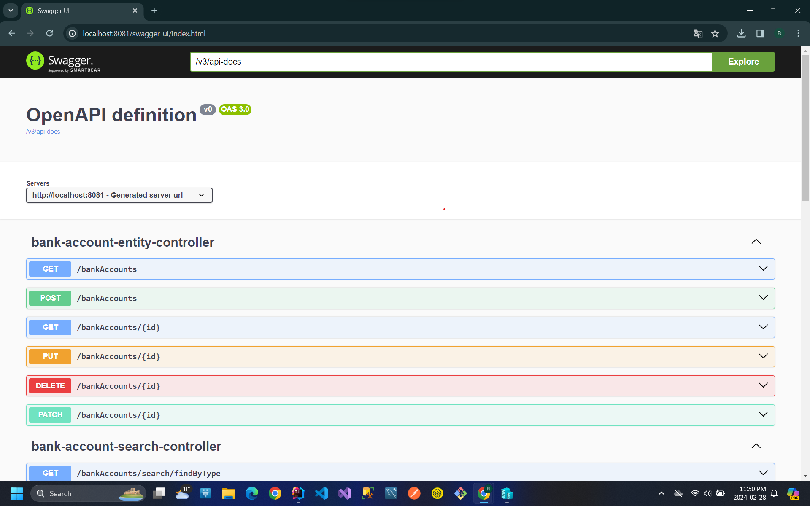
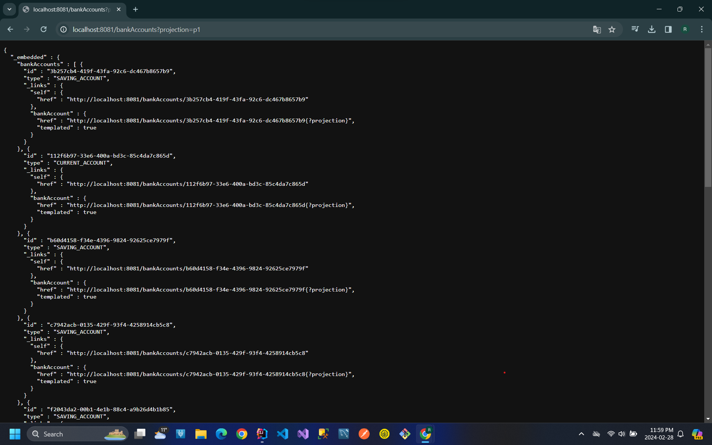

<h2>Micro-service de Gestion de Comptes avec Spring Boot</h2>
<h4>1. Création du Projet Spring Boot :</h4>
    
Le projet a été créé en utilisant Spring Boot avec les dépendances Web, Spring Data JPA, H2 et Lombok. Ces dépendances fournissent les fonctionnalités nécessaires pour développer un micro-service RESTful et persister les données des comptes dans une base de données H2.

<h4>2. Création de l'Entité JPA Compte :</h4>
    
Une entité JPA nommée "Account" a été créée pour représenter les comptes dans la base de données. Cette entité contient les attributs nécessaires tels que l'identifiant du compte, le nom du titulaire, le solde, etc.

    
<h4>3. Création de l'Interface CompteRepository :</h4>
    
Un repository Spring Data nommé "CompteRepository" a été créé pour interagir avec la base de données et effectuer des opérations CRUD (Create, Read, Update, Delete) sur les entités "Compte".

<h4>4. Test de la Couche DAO :</h4>
    
La couche DAO a été testée pour s'assurer que les opérations CRUD fonctionnent correctement. Des tests unitaires ont été écrits pour chaque méthode du repository afin de garantir le bon fonctionnement de la persistance des données.

<h4>5. Création du Web Service RESTful :</h4>
    
Un web service RESTful a été développé pour gérer les comptes. Il expose des endpoints HTTP pour créer, lire, mettre à jour et supprimer des comptes.

<h4>6. Test du Micro-service avec Postman :</h4>
    
Le micro-service a été testé en utilisant Postman, un client REST, pour envoyer des requêtes HTTP aux endpoints exposés et vérifier les réponses renvoyées par le service.

    
<h4>7. Génération et Test de la Documentation Swagger :</h4>
    
La documentation Swagger des API REST du web service a été générée automatiquement à l'aide de Springfox et Swagger UI. Les endpoints ont été documentés avec des descriptions claires et des exemples de requêtes et de réponses.

    
<h4>8. Exposition d'une API Restful avec Spring Data Rest :</h4>
    
Une API RESTful a été exposée en utilisant Spring Data Rest. Cela permet d'exploiter des projections pour contrôler les données renvoyées par les endpoints et fournir une interface RESTful basée sur les conventions.

    
     
<h4>9. Création des DTOs et Mappers :</h4>
    
Des DTOs (Data Transfer Objects) ont été créés pour transférer des données entre les couches du micro-service. Des mappers ont été utilisés pour convertir les entités JPA en DTOs et vice versa.

<h4>10. Création de la Couche Service (Métier) du Micro-service :</h4>
    
La couche service métier a été créée pour encapsuler la logique métier du micro-service. Cela garantit que la logique métier est séparée de la couche de persistance des données et peut être testée de manière indépendante.
